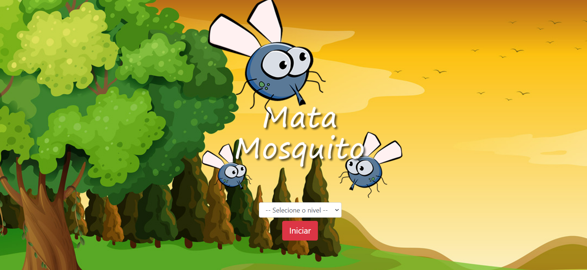

<h1 align="center"> Mata Mosquito </h1>

  <a href="#-sobre">Sobre</a>&nbsp;&nbsp;&nbsp;|&nbsp;&nbsp;&nbsp;
  <a href="#-tecnologias">Tecnologias</a>&nbsp;&nbsp;&nbsp;|&nbsp;&nbsp;&nbsp;
  <a href="#memo-licença">Licença</a>

  

 

  

## 🎧 Sobre

É um game web que foi criado com o intuito de estudos de JS.

---

## 🚀 Tecnologias

Esse projeto foi desenvolvido com as seguintes tecnologias:

- HTML5
- CSS3
- JavaScript
- Git e Github

## :memo: Licença

Esse projeto está sob a licença MIT.

---

Feito com ♥ by [Allan Gomes](https://www.linkedin.com/in/allanrsgomes/)
